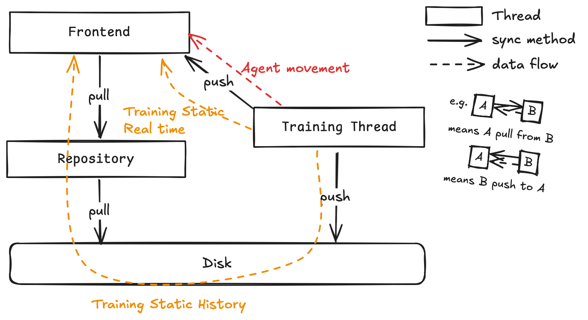

<div align="center">

# ***Matchman***: 一个火柴人尝试站起来

[]()
[]() 
[]()
[](https://nyteplus.github.io/Matchman/)

</div>
我创建了一个具有真实物理引擎的pymunk沙箱，火柴人的身体由多个刚体和关节组成，基于torch搭建深度强化学习算法训练火柴人学会站立和行走。 模型接受火柴人各躯干的位置和速度信息，输出每个时段给予电机的角动量。 我构建的<strong>pymunk二维沙箱</strong>和通用强化学习框架 <strong>NyteRL</strong>，只需要实现简单的接口即可定制自己的环境、模型、agent和奖励，极易编辑和拓展。 

<!-- https://simpleicons.org -->

> [!IMPORTANT]
> 目前服务处于测试阶段，资源有限。感谢以下平台提供的免费托管服务GitHub Pages静态网站托管、Koyeb免费服务托管。为避免服务过载，请合理控制访问频率。

<p align="center">

</p>

## 📦 Installation

### Dockerhub Image
> Dockerhub需要代理访问

我推荐使用容器进行部署，从Dockerhub下载镜像并运行容器
```bash
docker pull nyteplus/matchman-backend:amd
docker run -p 5000:5000 nyteplus/matchman-backend:amd
```

### Build Locally
> 构建使用了清华镜像源，如果部署到海外机器可以取消镜像源配置

下载仓库之后，手动构建容器并进行构建运行，进入容器后端将直接处于运行状态。
```bash
git clone https://github.com/NytePlus/Matchman.git
cd Matchman

docker build -t matchman-backend .
docker run matchman-backend:latest 
```

### Build with Pip
```bash
git clone https://github.com/NytePlus/Matchman.git
cd Matchman

conda create -n matchman python=3.13
conda activate matchman

conda install pip
pip install -r requirements.txt
pip install torch --index-url https://download.pytorch.org/whl/cpu
```

## 🚀 Quick Start

### Launch Frontend & Training & Tensorboard
我们推荐将前端部署在Github Pages上，可以极大减少对于系统、浏览器的适配性问题。当然也可以通过打开`index.html`的方式进行简单访问，需要修改`src/deploy/static/js/chart.js`中第一行为后端的url。

启动flask后端时，模型训练将和后端同步运行。我们推荐直接使用本地训练框架，绕过前后端使用客户端可视化组件运行。
```bash
PYTHONPATH=. python src/main.py --draw
```
启动训练之后，你可以在ui界面中观察火柴人动态，以及在tensorboard中观看训练曲线

### Launch Backend
flask在生产环境中需要另外一个插件启动，不过我们推荐使用开发环境启动flask后端。在开发环境启动flask后端，对内存占用显著减少，但只具有单线程能力，并且在高并发下会产生其他内存问题

```bash
# 开发环境
PYTHONPATH=. python src/deploy/backend.py

# 生产环境
PYTHONPATH=. gunicorn -w 1 -b 0.0.0.0:5000 --worker-class eventlet wsgi:app
```